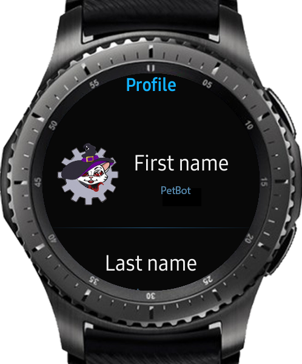

# SocialGear

VKontake Tizen Wearable client

## Features:

Autonomous work on watch. Phone is needed for authorization only.

News
* Watch your news
* They're changing when swipe left/right on header or rotate bezel
* List shows first attachment, text, author and number of other attachments
* Tap to see details and more attachments
 
Messages
* Shows number of unread messages on main page
* Watch your dialogs
* Tap dialog to open conversation or reply message
* While app is opened, it checks new messages every 5 seconds, every 2 when dialog or conversation is opened

Profile
* See your personal data
* See your friends
* See your friend's friends

[Phone part can be found here](https://github.com/RumataEstorish/GearHub)
